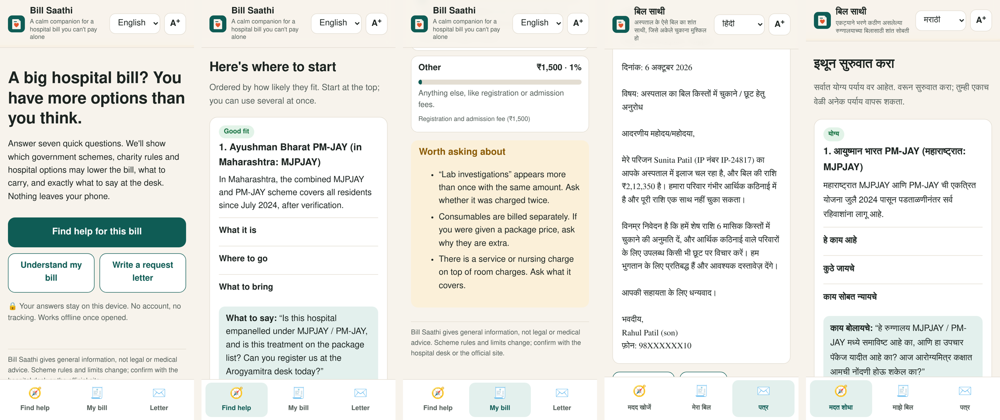

# Bill Saathi · बिल साथी

**A calm companion for a hospital bill you can't pay alone.**
Live: **https://jaypokale.github.io/billsaathi/** · English · हिंदी · मराठी · works offline · nothing leaves your phone



## The problem

In India, most hospital costs are paid out of pocket, often in a single bill at discharge. The help that exists is
real but scattered: government cover (PM-JAY / MJPJAY), a legal duty on charity-trust hospitals in Maharashtra to keep
free and concessional beds, the Chief Minister's and Prime Minister's relief funds, insurance people forget they
have, and the plain fact that billing desks negotiate. Families find out about these *after* paying, if at all,
usually standing at a billing counter, stressed, on a phone, sometimes not in English.

## Who it's for

The relative standing at the billing desk: a son, a daughter or a spouse, often reading on a budget phone, often more
comfortable in Hindi or Marathi, with no time to research schemes.

## What it does

1. **Find help (7 tap-only questions, about 1 minute).** State, hospital type, age 70+, rough income, ration card,
   serious illness, insurance/student. Bill Saathi ranks the options that may apply: **Good fit / Worth applying /
   Check this / Always ask**. Each card says why it may fit, where to go *inside the hospital* (Arogyamitra desk,
   charity desk, TPA desk), what documents to carry, and **the exact sentence to say at the desk**, with copy and
   read-aloud buttons. There are call buttons for official helplines (14555, 1800-123-2211) and links to official
   portals.
2. **My checklist.** All documents from the matching options, de-duplicated, tickable and printable.
3. **Understand my bill.** Paste the bill lines. Bill Saathi groups them (room, doctor, surgery, medicines,
   consumables, tests, nursing), shows each group's share, explains each in plain words, and flags what's worth asking:
   duplicate charges, consumables billed outside a package, nursing on top of room rent, very large lump sums.
4. **Write a request letter.** Itemised bill, instalments/concession, or a charity (IPF) reserved bed, written in
   English, Hindi or Marathi from a short form. Copy, print, or share on WhatsApp.

## Design decisions

- **Screen time is stress time.** One question per screen, big tap targets (≥ 52 px), auto-advance after a choice,
  "Not sure" on every question, and the answer, "what to say", shown before anything else.
- **Language is not a translation afterthought.** Every word of the interface, all 8 options and all 3 letters exist
  in English, Hindi and Marathi. The language switch re-renders the current screen in place, without losing answers.
- **Accessible by default.** Semantic HTML, a visible focus ring, skip link, live regions, a text-size toggle (A+), dark
  mode, reduced-motion support, and read-aloud through the phone's own voice (hi-IN / mr-IN / en-IN). **axe-core
  reports 0 WCAG 2.1 AA violations on every screen**, in light and dark mode.
- **Private and offline.** A static app with no backend, no analytics and no account. Answers live in `localStorage`
  on the device. A service worker caches the app so it works in a hospital basement with no signal.
- **Honest about uncertainty.** Every card links to its official source, and the app says when the rules were last
  checked (October 2026) and that rules change. It never says "you are eligible"; it says "good fit" and what to ask.

## Sources (checked October 2026)

- PM-JAY / Ayushman Vay Vandana: beneficiary.nha.gov.in, helpline 14555. ₹5 lakh per family per year; all
  people aged 70+ regardless of income.
- MJPJAY (Maharashtra): integrated with PM-JAY. ₹5 lakh per family per year, extended to all residents (after
  verification) from July 2024.
- Maharashtra charity hospitals (Bombay Public Trusts Act, IPF scheme): 10% of beds free for family income up to
  ₹1.8 lakh, 10% concessional up to ₹3.6 lakh. State help desk: charitymedicalhelpdesk.maharashtra.gov.in,
  1800-123-2211.
- CM Medical Assistance Fund (Maharashtra): cmrf.maharashtra.gov.in. PM National Relief Fund: pmnrf.gov.in.

## Run it

It's plain HTML, CSS and JavaScript, with no build step:

```bash
python3 -m http.server 8790   # then open http://localhost:8790
```

Files: `index.html`, `styles.css`, `app.js` (logic), `i18n.js` (interface text), `schemes.js` (the eight options,
with fit rules and text in three languages), `sw.js` (offline), `manifest.json` (installable).

## Limits

Scheme rules are summarised, not legal advice, and the state-specific options currently cover Maharashtra in depth.
The bill explainer uses keyword rules, not an understanding of medicine, so it suggests questions to ask rather than
deciding what's wrong.

Built with an AI coding assistant (Claude Code). MIT licence.
